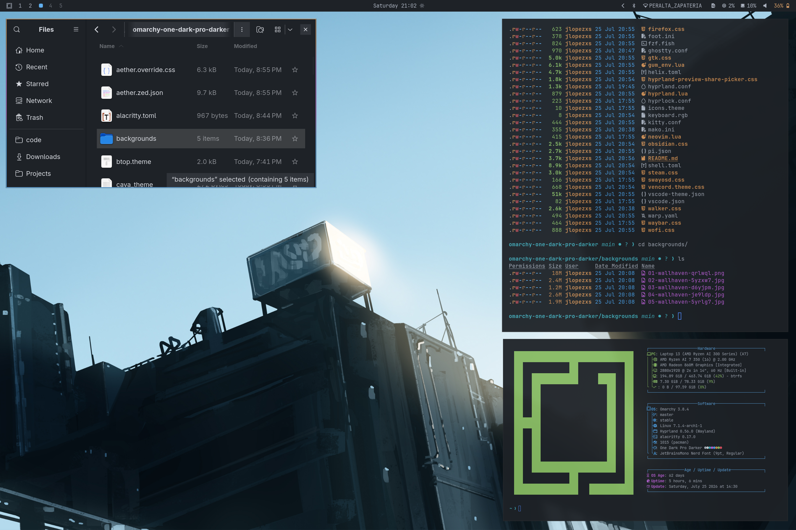
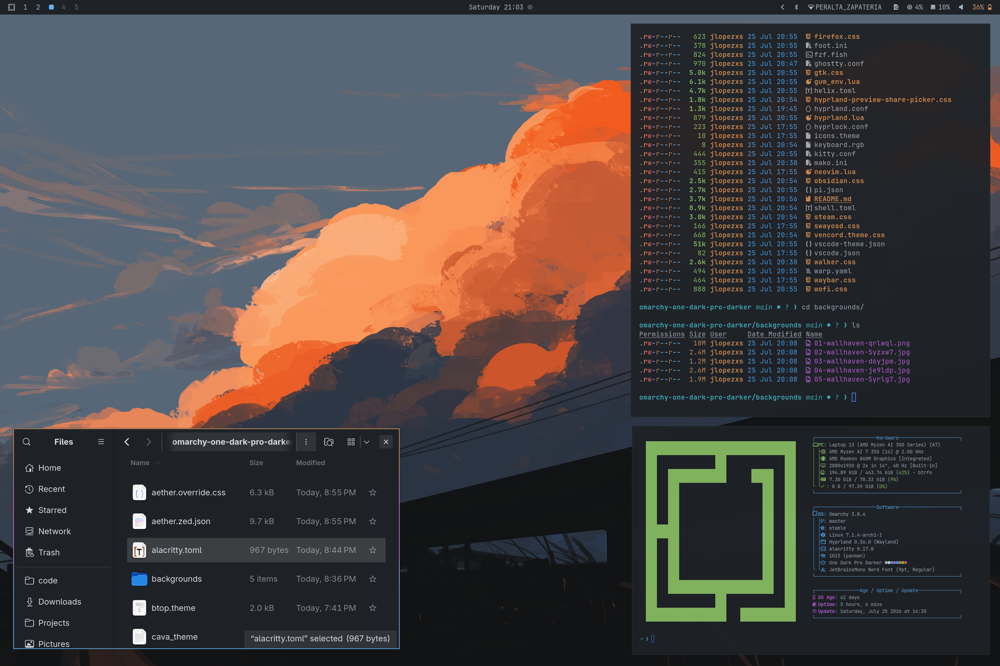
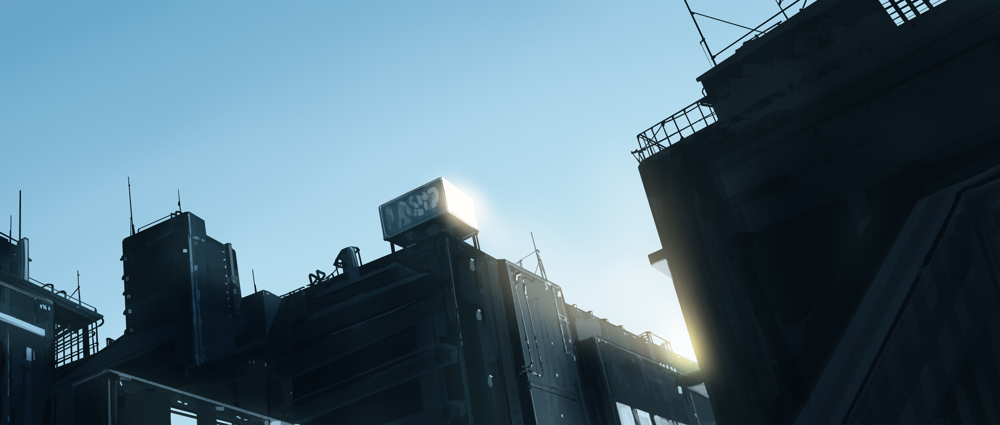

# Omarchy One Dark Pro Darker

Dark [One Dark Pro Darker](https://github.com/Binaryify/OneDark-Pro) palette for Omarchy/Hyprland, with matching terminal, UI, and app themes plus a small wallpaper set.


## Install

Use the Omarchy theme installer:

```bash
omarchy-theme-install https://github.com/jlopezxs/omarchy-one-dark-pro-darker-theme
```

## What's included

- Hyprland rules and opacity tuning (`hyprland.conf`, `hyprland.lua`)
- Hyprlock styling (`hyprlock.conf`)
- Waybar colors (`waybar.css`)
- Terminals: Alacritty (`alacritty.toml`), Kitty (`kitty.conf`), Ghostty (`ghostty.conf`), Foot (`foot.ini`), Warp (`warp.yaml`)
- Shell/tools: Fish colors (`colors.fish`), fzf (`fzf.fish`), Gum (`gum_env.lua`)
- Apps/UI: GTK (`gtk.css`), Chromium (`chromium.theme`), Firefox (`firefox.css`), Wofi (`wofi.css`), Walker (`walker.css`)
- System tools: btop (`btop.theme`), cava (`cava_theme`), mako (`mako.ini`), SwayOSD (`swayosd.css`)
- Editors: Neovim (`neovim.lua`), Helix (`helix.toml`), VS Code (`vscode.json`, `vscode-theme.json`), Zed (`aether.zed.json`)
- Extras: Steam (`steam.css`), Vencord (`vencord.theme.css`), Obsidian (`obsidian.css`), Pi (`pi.json`), Omarchy shell (`shell.toml`), icons (`icons.theme`)
- Aether theme overrides (`aether.override.css`, `aether.zed.json`)
- Unlock / Plymouth: `unlock.png`, `preview-unlock.png` (listed under Style > Unlock)
## Neovim note

`neovim.lua` uses [`olimorris/onedarkpro.nvim`](https://github.com/olimorris/onedarkpro.nvim) with the `onedark_dark` colorscheme and background overrides matching this theme (`#23272e` / `#1e2227`).

## Colors

Palette from [`oneDarkProDarker.ts`](https://github.com/Binaryify/OneDark-Pro/blob/master/src/themes/data/oneDarkProDarker.ts). Full tokens live in [`colors.toml`](colors.toml).

| Role | Hex |
|------|-----|
| Background | `#1e2227` |
| Dark background | `#181a1f` |
| Foreground | `#abb2bf` |
| Accent | `#61afef` |
| Cursor | `#528bff` |
| Selection | `#61afef` |
| Red | `#e05561` |
| Green | `#8cc265` |
| Yellow | `#d18f52` |
| Magenta | `#c162de` |
| Cyan | `#42b3c2` |
| Orange | `#d19a66` |
| Muted | `#495162` |

### ANSI

| | Black | Red | Green | Yellow | Blue | Magenta | Cyan | White |
|---|-------|-----|-------|--------|------|---------|------|-------|
| Normal | `#3f4451` | `#e05561` | `#8cc265` | `#d18f52` | `#4aa5f0` | `#c162de` | `#42b3c2` | `#d7dae0` |
| Bright | `#61afef` | `#ff616e` | `#a5e075` | `#f0a45d` | `#4dc4ff` | `#de73ff` | `#4cd1e0` | `#e6e6e6` |

## Screenshots

| | |
| --- | --- |
|  |  |

## Wallpapers

| | | |
| --- | --- | --- |
|  |  |  |
|  |  | |

## Attribution

- One Dark Pro palette by Binaryify: <https://github.com/Binaryify/OneDark-Pro>
- Multi-app theme layout inspired by [omarchy-miasma-theme](https://github.com/OldJobobo/omarchy-miasma-theme)
